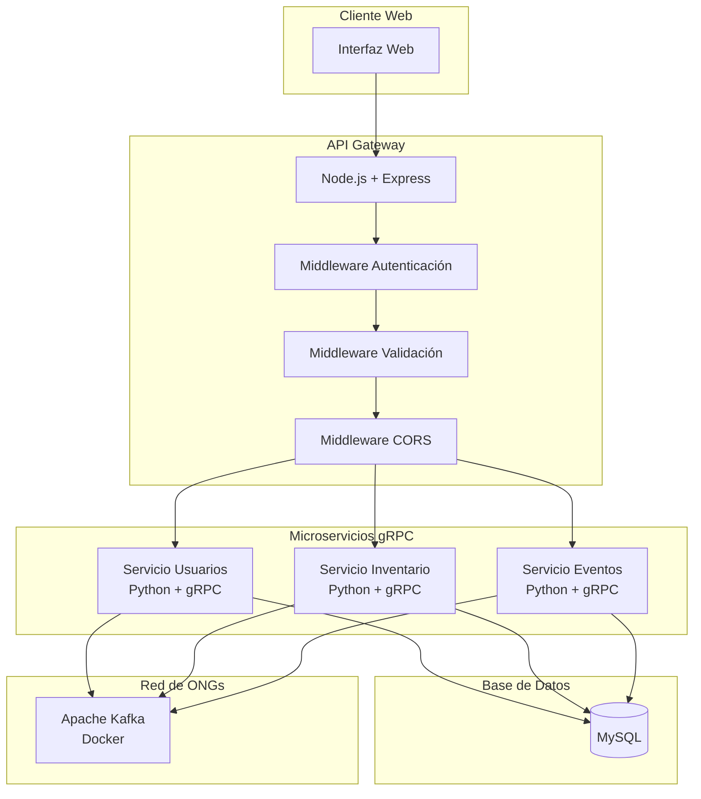

# Documento de Diseño - Sistema ONG Backend

## Visión General

El Sistema ONG Backend es una plataforma distribuida basada en microservicios que gestiona usuarios, inventario de donaciones y eventos solidarios para la ONG "Empuje Comunitario". El sistema utiliza gRPC para comunicación interna entre servicios, un API Gateway REST en Node.js/Express para la interfaz web, y Apache Kafka para la comunicación asíncrona entre ONGs de la red.

## Arquitectura

### Arquitectura de Alto Nivel



### Patrones Arquitectónicos

1. **Microservicios**: Separación de responsabilidades en servicios independientes
2. **API Gateway**: Punto único de entrada para todas las peticiones REST
3. **Event-Driven Architecture**: Comunicación asíncrona via Kafka para integración entre ONGs
4. **Repository Pattern**: Abstracción de acceso a datos en cada servicio
5. **Middleware Pattern**: Procesamiento de peticiones en capas (autenticación, validación, CORS)

## Componentes y Interfaces

### API Gateway (Node.js + Express)

**Responsabilidades:**
- Enrutamiento de peticiones REST a servicios gRPC correspondientes
- Autenticación y autorización centralizada
- Validación de entrada y transformación de datos
- Manejo de CORS y headers de seguridad
- Documentación Swagger/OpenAPI

**Estructura de Directorios:**
```
api-gateway/
├── src/
│   ├── routes/
│   │   ├── usuarios.js
│   │   ├── inventario.js
│   │   └── eventos.js
│   ├── middleware/
│   │   ├── autenticacion.js
│   │   ├── autorizacion.js
│   │   ├── validacion.js
│   │   └── errorHandler.js
│   ├── grpc-clients/
│   │   ├── usuarioClient.js
│   │   ├── inventarioClient.js
│   │   └── eventoClient.js
│   ├── config/
│   │   ├── database.js
│   │   ├── grpc.js
│   │   └── swagger.js
│   └── app.js
├── package.json
└── README.md
```

**Endpoints REST:**

```javascript
// Autenticación
POST /api/auth/login
POST /api/auth/logout
GET  /api/auth/perfil

// Usuarios (Solo Presidente)
GET    /api/usuarios
POST   /api/usuarios
PUT    /api/usuarios/:id
DELETE /api/usuarios/:id

// Inventario (Presidente, Vocal)
GET    /api/inventario
POST   /api/inventario
PUT    /api/inventario/:id
DELETE /api/inventario/:id

// Eventos (Presidente, Coordinador, Voluntario)
GET    /api/eventos
POST   /api/eventos
PUT    /api/eventos/:id
DELETE /api/eventos/:id
POST   /api/eventos/:id/participantes
DELETE /api/eventos/:id/participantes/:usuarioId

// Red de ONGs
GET    /api/red/solicitudes-donaciones
POST   /api/red/solicitudes-donaciones
GET    /api/red/ofertas-donaciones
POST   /api/red/ofertas-donaciones
POST   /api/red/transferencias-donaciones
GET    /api/red/eventos-externos
POST   /api/red/eventos-externos/adhesion
```

### Servicio de Usuarios (Python + gRPC)

**Responsabilidades:**
- Gestión CRUD de usuarios
- Autenticación y generación de tokens JWT
- Encriptación de contraseñas con bcrypt
- Envío de emails con contraseñas generadas (Nodemailer + Ethereal)
- Validación de roles y permisos

**Definición gRPC (proto/usuario.proto):**
```protobuf
syntax = "proto3";

package usuario;

service UsuarioService {
  rpc CrearUsuario(CrearUsuarioRequest) returns (UsuarioResponse);
  rpc ObtenerUsuario(ObtenerUsuarioRequest) returns (UsuarioResponse);
  rpc ListarUsuarios(ListarUsuariosRequest) returns (ListarUsuariosResponse);
  rpc ActualizarUsuario(ActualizarUsuarioRequest) returns (UsuarioResponse);
  rpc EliminarUsuario(EliminarUsuarioRequest) returns (EliminarUsuarioResponse);
  rpc AutenticarUsuario(AutenticarRequest) returns (AutenticarResponse);
  rpc ValidarToken(ValidarTokenRequest) returns (ValidarTokenResponse);
}

message Usuario {
  int32 id = 1;
  string nombreUsuario = 2;
  string nombre = 3;
  string apellido = 4;
  string telefono = 5;
  string email = 6;
  string rol = 7;
  bool activo = 8;
  string fechaHoraAlta = 9;
  string usuarioAlta = 10;
  string fechaHoraModificacion = 11;
  string usuarioModificacion = 12;
}

message CrearUsuarioRequest {
  string nombreUsuario = 1;
  string nombre = 2;
  string apellido = 3;
  string telefono = 4;
  string email = 5;
  string rol = 6;
  string usuarioCreador = 7;
}

message AutenticarRequest {
  string identificador = 1; // nombreUsuario o email
  string clave = 2;
}

message AutenticarResponse {
  bool exitoso = 1;
  string token = 2;
  Usuario usuario = 3;
  string mensaje = 4;
}
```

### Servicio de Inventario (Python + gRPC)

**Responsabilidades:**
- Gestión CRUD de donaciones
- Control de stock y validaciones de cantidad
- Auditoría de operaciones
- Integración con Kafka para transferencias entre ONGs

**Definición gRPC (proto/inventario.proto):**
```protobuf
syntax = "proto3";

package inventario;

service InventarioService {
  rpc CrearDonacion(CrearDonacionRequest) returns (DonacionResponse);
  rpc ObtenerDonacion(ObtenerDonacionRequest) returns (DonacionResponse);
  rpc ListarDonaciones(ListarDonacionesRequest) returns (ListarDonacionesResponse);
  rpc ActualizarDonacion(ActualizarDonacionRequest) returns (DonacionResponse);
  rpc EliminarDonacion(EliminarDonacionRequest) returns (EliminarDonacionResponse);
  rpc ActualizarStock(ActualizarStockRequest) returns (ActualizarStockResponse);
  rpc ValidarStock(ValidarStockRequest) returns (ValidarStockResponse);
}

message Donacion {
  int32 id = 1;
  string categoria = 2; // ROPA, ALIMENTOS, JUGUETES, UTILES_ESCOLARES
  string descripcion = 3;
  int32 cantidad = 4;
  bool eliminado = 5;
  string fechaHoraAlta = 6;
  string usuarioAlta = 7;
  string fechaHoraModificacion = 8;
  string usuarioModificacion = 9;
}

message ActualizarStockRequest {
  int32 donacionId = 1;
  int32 cantidadCambio = 2; // Positivo para sumar, negativo para restar
  string usuarioModificacion = 3;
  string motivo = 4;
}
```

### Servicio de Eventos (Python + gRPC)

**Responsabilidades:**
- Gestión CRUD de eventos solidarios
- Manejo de participantes y asignaciones
- Validación de fechas futuras
- Registro de donaciones repartidas
- Integración con Kafka para eventos externos

**Definición gRPC (proto/evento.proto):**
```protobuf
syntax = "proto3";

package evento;

service EventoService {
  rpc CrearEvento(CrearEventoRequest) returns (EventoResponse);
  rpc ObtenerEvento(ObtenerEventoRequest) returns (EventoResponse);
  rpc ListarEventos(ListarEventosRequest) returns (ListarEventosResponse);
  rpc ActualizarEvento(ActualizarEventoRequest) returns (EventoResponse);
  rpc EliminarEvento(EliminarEventoRequest) returns (EliminarEventoResponse);
  rpc AgregarParticipante(AgregarParticipanteRequest) returns (ParticipanteResponse);
  rpc QuitarParticipante(QuitarParticipanteRequest) returns (ParticipanteResponse);
  rpc RegistrarDonacionesRepartidas(RegistrarDonacionesRequest) returns (RegistrarDonacionesResponse);
}

message Evento {
  int32 id = 1;
  string nombre = 2;
  string descripcion = 3;
  string fechaHora = 4;
  repeated int32 participantesIds = 5;
  repeated DonacionRepartida donacionesRepartidas = 6;
}

message DonacionRepartida {
  int32 donacionId = 1;
  int32 cantidadRepartida = 2;
  string usuarioRegistro = 3;
  string fechaHoraRegistro = 4;
}
```

## Modelos de Datos

### Base de Datos MySQL

**Tabla: usuarios**
```sql
CREATE TABLE usuarios (
    id INT AUTO_INCREMENT PRIMARY KEY,
    nombre_usuario VARCHAR(50) UNIQUE NOT NULL,
    nombre VARCHAR(100) NOT NULL,
    apellido VARCHAR(100) NOT NULL,
    telefono VARCHAR(20),
    clave_hash VARCHAR(255) NOT NULL,
    email VARCHAR(255) UNIQUE NOT NULL,
    rol ENUM('PRESIDENTE', 'VOCAL', 'COORDINADOR', 'VOLUNTARIO') NOT NULL,
    activo BOOLEAN DEFAULT true,
    fecha_hora_alta TIMESTAMP DEFAULT CURRENT_TIMESTAMP,
    usuario_alta VARCHAR(50),
    fecha_hora_modificacion TIMESTAMP NULL ON UPDATE CURRENT_TIMESTAMP,
    usuario_modificacion VARCHAR(50)
);
```

**Tabla: donaciones**
```sql
CREATE TABLE donaciones (
    id INT AUTO_INCREMENT PRIMARY KEY,
    categoria ENUM('ROPA', 'ALIMENTOS', 'JUGUETES', 'UTILES_ESCOLARES') NOT NULL,
    descripcion TEXT,
    cantidad INT NOT NULL CHECK (cantidad >= 0),
    eliminado BOOLEAN DEFAULT false,
    fecha_hora_alta TIMESTAMP DEFAULT CURRENT_TIMESTAMP,
    usuario_alta VARCHAR(50),
    fecha_hora_modificacion TIMESTAMP NULL ON UPDATE CURRENT_TIMESTAMP,
    usuario_modificacion VARCHAR(50)
);
```

**Tabla: eventos**
```sql
CREATE TABLE eventos (
    id INT AUTO_INCREMENT PRIMARY KEY,
    nombre VARCHAR(255) NOT NULL,
    descripcion TEXT,
    fecha_hora TIMESTAMP NOT NULL,
    fecha_hora_alta TIMESTAMP DEFAULT CURRENT_TIMESTAMP,
    usuario_alta VARCHAR(50),
    fecha_hora_modificacion TIMESTAMP NULL ON UPDATE CURRENT_TIMESTAMP,
    usuario_modificacion VARCHAR(50)
);
```

**Tabla: evento_participantes**
```sql
CREATE TABLE evento_participantes (
    evento_id INT,
    usuario_id INT,
    fecha_asignacion TIMESTAMP DEFAULT CURRENT_TIMESTAMP,
    PRIMARY KEY (evento_id, usuario_id),
    FOREIGN KEY (evento_id) REFERENCES eventos(id) ON DELETE CASCADE,
    FOREIGN KEY (usuario_id) REFERENCES usuarios(id) ON DELETE CASCADE
);
```

**Tabla: donaciones_repartidas**
```sql
CREATE TABLE donaciones_repartidas (
    id INT AUTO_INCREMENT PRIMARY KEY,
    evento_id INT,
    donacion_id INT,
    cantidad_repartida INT NOT NULL CHECK (cantidad_repartida > 0),
    usuario_registro VARCHAR(50),
    fecha_hora_registro TIMESTAMP DEFAULT CURRENT_TIMESTAMP,
    FOREIGN KEY (evento_id) REFERENCES eventos(id) ON DELETE CASCADE,
    FOREIGN KEY (donacion_id) REFERENCES donaciones(id)
);
```

**Tablas para Red de ONGs:**
```sql
CREATE TABLE solicitudes_externas (
    id INT AUTO_INCREMENT PRIMARY KEY,
    id_organizacion VARCHAR(50) NOT NULL,
    id_solicitud VARCHAR(50) NOT NULL,
    categoria ENUM('ROPA', 'ALIMENTOS', 'JUGUETES', 'UTILES_ESCOLARES') NOT NULL,
    descripcion TEXT,
    activa BOOLEAN DEFAULT true,
    fecha_recepcion TIMESTAMP DEFAULT CURRENT_TIMESTAMP,
    UNIQUE KEY unique_solicitud (id_organizacion, id_solicitud)
);

CREATE TABLE ofertas_externas (
    id INT AUTO_INCREMENT PRIMARY KEY,
    id_organizacion VARCHAR(50) NOT NULL,
    id_oferta VARCHAR(50) NOT NULL,
    categoria ENUM('ROPA', 'ALIMENTOS', 'JUGUETES', 'UTILES_ESCOLARES') NOT NULL,
    descripcion TEXT,
    cantidad INT NOT NULL,
    fecha_recepcion TIMESTAMP DEFAULT CURRENT_TIMESTAMP,
    UNIQUE KEY unique_oferta (id_organizacion, id_oferta)
);

CREATE TABLE eventos_externos (
    id INT AUTO_INCREMENT PRIMARY KEY,
    id_organizacion VARCHAR(50) NOT NULL,
    id_evento VARCHAR(50) NOT NULL,
    nombre VARCHAR(255) NOT NULL,
    descripcion TEXT,
    fecha_hora TIMESTAMP NOT NULL,
    activo BOOLEAN DEFAULT true,
    fecha_recepcion TIMESTAMP DEFAULT CURRENT_TIMESTAMP,
    UNIQUE KEY unique_evento (id_organizacion, id_evento)
);
```

## Integración con Kafka

### Topics de Kafka

1. **`/solicitud-donaciones`**: Solicitudes de donaciones entre ONGs
2. **`/transferencia-donaciones/{idOrganizacion}`**: Transferencias de donaciones
3. **`/oferta-donaciones`**: Ofertas de donaciones disponibles
4. **`/baja-solicitud-donaciones`**: Cancelación de solicitudes
5. **`/eventos-solidarios`**: Publicación de eventos externos
6. **`/baja-evento-solidario`**: Cancelación de eventos
7. **`/adhesion-evento/{idOrganizador}`**: Adhesión a eventos externos

### Estructura de Mensajes Kafka

**Solicitud de Donaciones:**
```json
{
  "idOrganizacion": "ong-empuje-comunitario",
  "idSolicitud": "SOL-2024-001",
  "donaciones": [
    {
      "categoria": "ALIMENTOS",
      "descripcion": "Puré de tomates"
    }
  ],
  "timestamp": "2024-01-15T10:30:00Z"
}
```

**Transferencia de Donaciones:**
```json
{
  "idSolicitud": "SOL-2024-001",
  "idOrganizacionDonante": "ong-empuje-comunitario",
  "donaciones": [
    {
      "categoria": "ALIMENTOS",
      "descripcion": "Puré de tomates",
      "cantidad": "2kg"
    }
  ],
  "timestamp": "2024-01-15T11:00:00Z"
}
```

### Configuración Docker Compose para Kafka

```yaml
version: '3.8'
services:
  zookeeper:
    image: wurstmeister/zookeeper:3.4.6
    ports:
      - "2181:2181"
    environment:
      ZOOKEEPER_CLIENT_PORT: 2181

  kafka:
    image: wurstmeister/kafka:latest
    ports:
      - "9092:9092"
    environment:
      KAFKA_ADVERTISED_HOST_NAME: localhost
      KAFKA_ZOOKEEPER_CONNECT: zookeeper:2181
      KAFKA_CREATE_TOPICS: "solicitud-donaciones:1:1,oferta-donaciones:1:1,eventos-solidarios:1:1,baja-solicitud-donaciones:1:1,baja-evento-solidario:1:1"
    volumes:
      - /var/run/docker.sock:/var/run/docker.sock
    depends_on:
      - zookeeper
```

## Manejo de Errores

### Estrategia de Manejo de Errores

1. **API Gateway**: Middleware centralizado de manejo de errores
2. **Servicios gRPC**: Códigos de estado gRPC estándar
3. **Kafka**: Dead Letter Queue para mensajes fallidos
4. **Base de Datos**: Transacciones y rollback automático

### Códigos de Error Estándar

```javascript
// API Gateway - Códigos HTTP
const ERROR_CODES = {
  UNAUTHORIZED: 401,
  FORBIDDEN: 403,
  NOT_FOUND: 404,
  VALIDATION_ERROR: 400,
  INTERNAL_ERROR: 500,
  SERVICE_UNAVAILABLE: 503
};

// gRPC - Códigos de Estado
const GRPC_CODES = {
  OK: 0,
  INVALID_ARGUMENT: 3,
  NOT_FOUND: 5,
  ALREADY_EXISTS: 6,
  PERMISSION_DENIED: 7,
  UNAUTHENTICATED: 16,
  INTERNAL: 13
};
```

## Estrategia de Testing

### Tipos de Testing

1. **Pruebas Unitarias**: Jest para Node.js, pytest para Python
2. **Pruebas de Integración**: Testing de endpoints gRPC
3. **Pruebas de API**: Postman collections para endpoints REST
4. **Pruebas de Kafka**: Mockafka para testing de mensajería

### Estructura de Testing

```
tests/
├── unit/
│   ├── api-gateway/
│   ├── user-service/
│   ├── inventory-service/
│   └── events-service/
├── integration/
│   ├── grpc/
│   └── kafka/
└── api/
    └── postman/
```

### Configuración de Testing

**API Gateway (Jest):**
```javascript
// tests/unit/api-gateway/auth.test.js
const request = require('supertest');
const app = require('../../src/app');

describe('Autenticación', () => {
  test('POST /api/auth/login - credenciales válidas', async () => {
    const response = await request(app)
      .post('/api/auth/login')
      .send({
        identificador: 'admin@ong.com',
        clave: 'password123'
      });
    
    expect(response.status).toBe(200);
    expect(response.body.token).toBeDefined();
  });
});
```

**Servicios Python (pytest):**
```python
# tests/unit/user-service/test_usuario_service.py
import pytest
from src.services.usuario_service import UsuarioService

class TestUsuarioService:
    def test_crear_usuario_exitoso(self):
        service = UsuarioService()
        usuario = service.crear_usuario({
            'nombreUsuario': 'test_user',
            'email': 'test@ong.com',
            'nombre': 'Test',
            'apellido': 'User',
            'rol': 'VOLUNTARIO'
        })
        assert usuario.id is not None
        assert usuario.nombreUsuario == 'test_user'
```

## Seguridad

### Autenticación y Autorización

1. **JWT Tokens**: Generados por el servicio de usuarios
2. **Middleware de Autenticación**: Validación en API Gateway
3. **RBAC**: Control de acceso basado en roles
4. **Encriptación**: bcrypt para contraseñas, HTTPS para comunicación

### Configuración de Email

**Nodemailer con Ethereal (Testing):**
```javascript
// Servicio de Usuarios - Configuración de Email
const nodemailer = require('nodemailer');

// Configuración para Ethereal (desarrollo/testing)
const crearTransportadorEmail = async () => {
  const cuentaTest = await nodemailer.createTestAccount();
  
  return nodemailer.createTransporter({
    host: 'smtp.ethereal.email',
    port: 587,
    secure: false,
    auth: {
      user: cuentaTest.user,
      pass: cuentaTest.pass
    }
  });
};

// Función para enviar email con contraseña
const enviarEmailContraseña = async (email, nombreUsuario, contraseñaTemporal) => {
  const transportador = await crearTransportadorEmail();
  
  const info = await transportador.sendMail({
    from: '"Sistema ONG" <noreply@ong.com>',
    to: email,
    subject: 'Bienvenido al Sistema ONG - Credenciales de Acceso',
    html: `
      <h2>Bienvenido al Sistema ONG</h2>
      <p>Hola <strong>${nombreUsuario}</strong>,</p>
      <p>Tu cuenta ha sido creada exitosamente. Aquí están tus credenciales de acceso:</p>
      <ul>
        <li><strong>Usuario:</strong> ${nombreUsuario}</li>
        <li><strong>Email:</strong> ${email}</li>
        <li><strong>Contraseña temporal:</strong> ${contraseñaTemporal}</li>
      </ul>
      <p>Por favor, cambia tu contraseña después del primer inicio de sesión.</p>
      <p>Saludos,<br/>Equipo Sistema ONG</p>
    `
  });
  
  console.log('Email enviado:', nodemailer.getTestMessageUrl(info));
  return info;
};
```

### Configuración de Seguridad

```javascript
// API Gateway - Middleware de Autenticación
const jwt = require('jsonwebtoken');

const autenticarToken = (req, res, next) => {
  const authHeader = req.headers['authorization'];
  const token = authHeader && authHeader.split(' ')[1];
  
  if (!token) {
    return res.status(401).json({ mensaje: 'Token de acceso requerido' });
  }
  
  jwt.verify(token, process.env.JWT_SECRET, (err, usuario) => {
    if (err) {
      return res.status(403).json({ mensaje: 'Token inválido' });
    }
    req.usuario = usuario;
    next();
  });
};

// Middleware de Autorización por Rol
const autorizarRol = (rolesPermitidos) => {
  return (req, res, next) => {
    if (!rolesPermitidos.includes(req.usuario.rol)) {
      return res.status(403).json({ 
        mensaje: 'No tiene permisos para esta operación' 
      });
    }
    next();
  };
};
```

## Despliegue y DevOps

### Estructura Docker

```yaml
# docker-compose.yml
version: '3.8'
services:
  mysql:
    image: mysql:8.0
    environment:
      MYSQL_DATABASE: ong_sistema
      MYSQL_USER: ong_user
      MYSQL_PASSWORD: ong_password
      MYSQL_ROOT_PASSWORD: root_password
    volumes:
      - mysql_data:/var/lib/mysql
    ports:
      - "3306:3306"

  api-gateway:
    build: ./api-gateway
    ports:
      - "3000:3000"
    environment:
      - NODE_ENV=production
      - JWT_SECRET=your_jwt_secret
      - DB_HOST=mysql
    depends_on:
      - mysql
      - user-service
      - inventory-service
      - events-service

  user-service:
    build: ./services/user-service
    ports:
      - "50051:50051"
    environment:
      - DB_HOST=mysql
      - KAFKA_BROKERS=kafka:9092
    depends_on:
      - mysql
      - kafka

  inventory-service:
    build: ./services/inventory-service
    ports:
      - "50052:50052"
    environment:
      - DB_HOST=mysql
      - KAFKA_BROKERS=kafka:9092
    depends_on:
      - mysql
      - kafka

  events-service:
    build: ./services/events-service
    ports:
      - "50053:50053"
    environment:
      - DB_HOST=mysql
      - KAFKA_BROKERS=kafka:9092
    depends_on:
      - mysql
      - kafka

volumes:
  mysql_data:
```

### Scripts de Despliegue

```bash
#!/bin/bash
# deploy.sh

echo "Iniciando despliegue del Sistema ONG..."

# Construir imágenes
docker-compose build

# Iniciar servicios de infraestructura
docker-compose up -d mysql zookeeper kafka

# Esperar que los servicios estén listos
sleep 30

# Ejecutar migraciones de base de datos
docker-compose run --rm api-gateway npm run migrate

# Iniciar servicios de aplicación
docker-compose up -d user-service inventory-service events-service

# Iniciar API Gateway
docker-compose up -d api-gateway

echo "Despliegue completado. Sistema disponible en http://localhost:3000"
```

Este diseño proporciona una base sólida para implementar el sistema completo, con separación clara de responsabilidades, escalabilidad horizontal, y robustez en el manejo de errores y la comunicación entre servicios.